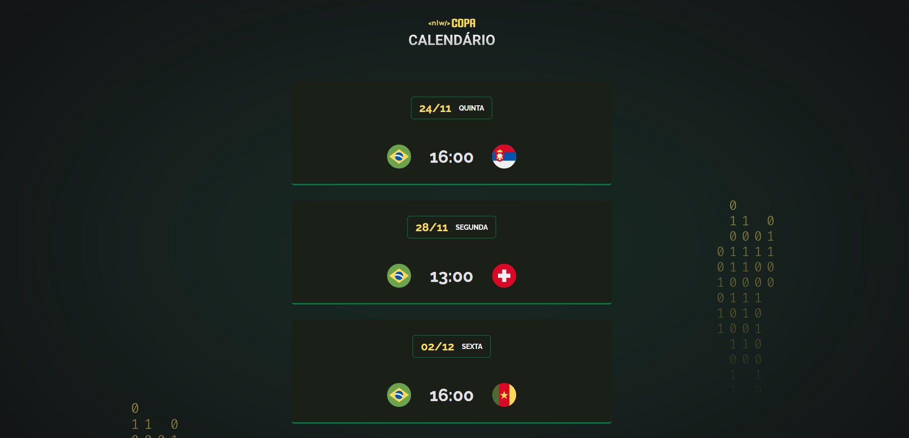

<h1 align="center"> Calendario da copa do mundo </h1>

calendário da copa do mundo, evento exclusivo e gratuito, promovido pela One bit code.  

  

## 🚀 Tecnologias

Esse projeto foi desenvolvido com as seguintes tecnologias:

- HTML e CSS
- JavaScript
- Git e Github
- Figma

## 💻 Projeto

Um pequeno projeto de um calendário da copa do mundo. 
muito interessante saber como o Java Script interage com o HTML e CSS.

- [visite o projeto online] (https://gsilvaol.github.io/Calendario-da-copa-do-mundo/)
